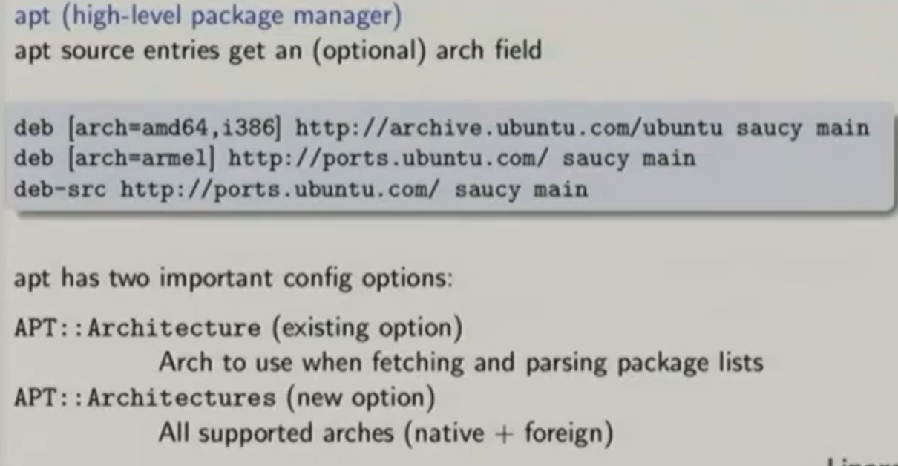
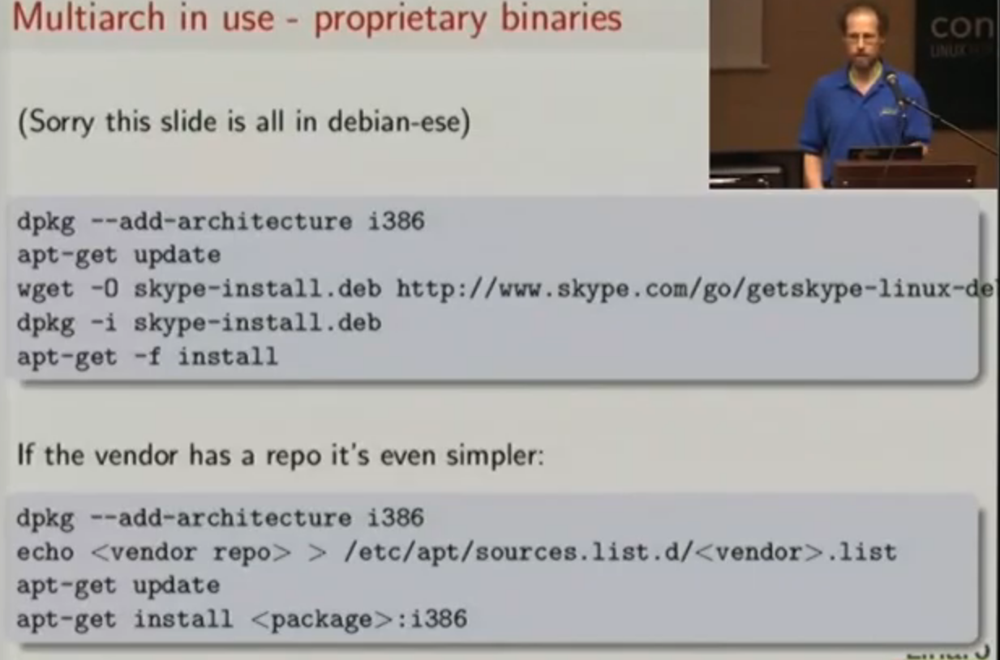

- https://unix.stackexchange.com/questions/458069/multilib-and-multiarch - what are multiarch and multilib?
- https://www.youtube.com/watch?v=fR7qdCbgGXA - what is the point of multiarch (great but DEEP video)?
- https://wiki.debian.org/Multiarch/HOWTO - brief multiarch description
- https://askubuntu.com/questions/113301/how-to-remove-all-i386-packages-from-ubuntu-64bit - how to remove i386 packages from Ubuntu
- https://unix.stackexchange.com/questions/272908/apt-looking-for-i386-files-even-though-architecture-is-amd64 - In Ubuntu amd64 installations, i386
  _is_ enabled as an additional architecture by default. If apt is complaining about missing i386, I can just specify amd64
- https://discourse.ubuntu.com/t/intel-32bit-packages-on-ubuntu-from-19-10-onwards/11263 - why does Ubuntu ship with i386 packages?
- https://unix.stackexchange.com/questions/271490/why-is-my-system-architecture-i386-on-a-64-bit-processor - describes what "cross-grading" is
- https://www.debian.org/doc/manuals/aptitude/ch02s04s05.en.html#tableSearchTermQuickGuide - aptitude search directives
- https://iliketoknow.wordpress.com/what-is-the-difference-between-isa-and-microarchitecture/ - description of microarchitecture itself
- https://www.quora.com/What-is-CPU-microarchitecture - another description of microarchitecture itself
- https://www.unixmen.com/enable-32-bit-support-64-bit-ubuntu-13-10-greater/ - enabling 32-bit support on 64-bit machine (I already have this)
# Examples
## View which installed packages were built for the i386 architecture (32-bit)
### Commands
```
$ aptitude search ~i~ri386
```
- This shows that Ubuntu came bundled with numerous 32-bit architecture packages by default. I wonder if I actually use any software that depends on
  these packages?
- I could remove these packages if I wanted (see 4rd source for disabling multiarch support), but I'll just leave them alone
## Examine multiarch-ready package metadata
### Commands
```
$ dpkg -p libbsd0
```
- On my system I have both libbsd0 and libbsd0:i386 installed, but I can only view the metadata for libbsd0. Why?
  - Just use `$ apt-cache show libbsd0:i386` instead
    - `$ dpkg -p libbsd0:i386` didn't work because "Users of APT-based frontends should use `$ apt-cache show <package name>` instead as the available
      file is only kept up-to-date when using dselect" (quote from dpkg-query man page)
- The "Multi-Arch" field of a package specifies the co-installability and dependencies between pacakges
- This package has field "Multi-Arch" with a value "same"
  - "same": if a package has the value "same", it's a library. The library depends on other stuff from explicitly the _same_ microachitecture _and_ can
    be co-installed with other libraries-with-the-same-name-but-are-built-for-different-microarchitectures 
    - This is true and confirmed by the 3rd source
  - "foreign": if a package has the value "foreign", it's a tool. The tool satisfies dependencies for any architecture and thus cannot be co-installed
    with other libraries-with-the-same-name-but-are-built-for-different-microarchitectures
    - This is true and confirmed by the 3rd source
  - "allowed": if a package has the value "allowed" it could be a library or tool depending on the other packages that use it. It can be treated as
    same or foreign
## View architectures
### Commands
```
$ dpkg --print-architecture # native architecture
$ dpkg --print-foreign-architectures # foreign architectures
```
## Add/remove foreign architecture
### Commands
```
$ dpkg --add-architecture i386 # I already have this
$ dpkg --remove-architecture i386 # dpkg won't do this until all i386 package are uninstalled from the system
```
## Tell apt which microarchitecture-versions of a package it should be getting
### Commands
- 
### Examine `/etc/apt/sources.list.d/google-chrome.list`
#### Files
##### `/etc/apt/sources.list.d/google-chrome.list`
```
deb [arch=amd64] http://dl.google.com/linux/chrome/deb/ stable main
```
- The `[arch=amd64]` component of this line specifies the microarchitecture to use for the package
- Without this component, `apt` defaults to using the set of architectures reported by `dpkg` (which is almost always what I want anyway)
  - Based on the output of `$ apt-cache policy`, it appears that `apt` queries sources for _both_ amd64 and i386 because there are numerous source +
    priority output lines that are nearly identical except for the microarchitecture
  - This behavior can be avoided by qualifying repositories with microarchitecture as shown in `/etc/apt/sources.list.d/google-chrome.list`
    - This source has a microarchitecture qualifier and only the amd64 source is shown by `$ apt-cache policy`
## Big use case: install vendor-specific *.deb
### Commands
- 
- Go to 18:30 in the video to see how these commands allow me to easily install vendor-debs that might have weird 32-bit dependencies. Very useful!
# Background
## What are multiarch and multilib?
- A microarchitecture is also called an "application binary interface" (ABI)
  - A microarchitecture is not the same thing an ISA. A microarchitecture defines _how_ an ISA is implemented through such concepts as instruction
    pipelining, branch prediction, out-of-order execution, etc.
- Multiarch and multilib are two different approaches to solving the same problem: running binaries built for different microarchitectures on the same
  machine 
  - E.g. running the applications that use the i386 microarchitecture (i.e. 32-bit) on an amd64 microarchitecture (i.e. 64-bit) system
- More specifically, they both handle installing the different versions of _library packages_ needed by applications built for different
  microarchitectures
- However, neither handles supporting system calls required by foreign architectures, nor the ability to interpet the machine instructions inside of
  binaries built for foreign architectures
  - Thus, multiarch and multilib can work fine, but a binary could still not execute on the host machine if it had system calls or machine
    instructions that the host machine did not understand
### Multiarch
- The `lib/` (32-bit) and `lib64/` (64-bit) convention has been around for a long time on x86 microarchitectures and can be considered the "poor mans
  version" of multiarch (though I really think that is might be a poor man's version of multilib? It doesn't matter). The point is: multiarch is more
  powerful and general than this convention
  - This convention is good enough for 90% of people, but we can do better! Enter multiarch
- The multiarch approach puts every microarchitecture's libraries in a subdirectory and then tell the C loader which default library to use
  - E.g. `/lib/x86_64-linux-gnu/libfoo/`, `/lib/i386-linux-gnu/libfoo`, etc.
- The fundamental concept of having a predictable, canonical path for every library regardless of microarchitecture is logically simple, but difficult
  to implement because poor man's variants of multiarch have been so prevalent in distributions for the last 15 years
- Debian and its derivatives use multiarch
### Multlib
- The multilib approach basically has a specific directory for every foreign architecture for every host architecture
  - E.g. for every amd64 host, 64-bit libraries go in `/lib/` while 32-bit libraries go in `/lib32/`
- Non-debian distributions use multilib
- Multlib allows me to installs multiple flavors of the same ABI that are optimized for different CPUs
  - E.g. newer ABIs run faster on newer CPUs because the newer ABIs are optimized for the newere CPUs. However, newer ABIs don't run on older CPUs
    because the newer ABIs use interfaces that don't exist on older CPUs. Old ABIs can run on newer CPUs because the newer CPU will have all of the
    instructions needed by the old ABI
  - Multiarch doesn't do any of this
# Purpose of multiarch on Ubuntu
- Ubuntu amd64 (64-bit) installations come bundled with some 32-bit packages because some 32-bit packages are needed to run legacy software applications
  - 32-bit packages are also refered to as "i386" packages
- The ability to install library packages from multiple architectures on the same machine is referred to as "multiarch"
- Multiarch is useful for several reasons:
  - I can have an arbitrary mix of different 64-bit and 32-bit applications on the same machine
  - Allows cross-grading from one architecture to another (IDK what this means)?
  - Allows installing the bare-minimum required libraries needed to emulate other host-incompatible microarchitectures via something like QEMU
  - Removes packaging complexity
- Multiarch does not do the following:
  - Does not allow 64-bit and 32-bit versions of the same application to be installed at the same time
    - E.g. I can't have a working 64-bit version _and_ a 32-bit version of `mkdir` in `/bin/` at the same time
    - Multiarch _could_ deal with applications/binaries too, but it doesn't right now
  - Does not specify ABI-compatible capabilities (unlike mulitlib) 
- Multiarch doesn't do the following, but it _could_ allow for:
  - "Partial architectures" (see video 10:10)
  - Cross-dependencies
  - Co-installable compilers
  - Automatic port bootstrapping
# Implementation of multiarch
- Using multiarch requires multiarch-aware `apt` and `dpkg` which are default nowadays