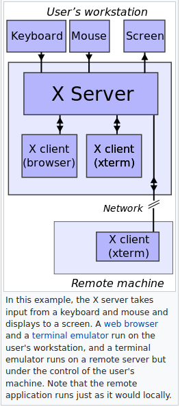

# Links
## Conceptual
- https://unix.stackexchange.com/questions/276168/what-is-x11-exactly - good introduction to X11, but other links should be read
- https://unix.stackexchange.com/questions/118813/what-is-the-difference-between-x11-and-xlib - great disambiguation of terms
- https://magcius.github.io/xplain/article/x-basics.html - great disambiguation of terms and a description of how the X server and X clients
  communicate
- https://en.wikipedia.org/wiki/X_Window_System_protocols_and_architecture - great description of X11 especially when paired with the immediately
  above link
- https://medium.com/mindorks/x-server-client-what-the-hell-305bd0dc857f - honestly not a good article, but it has some nice pictures
- http://www.linfo.org/x_server.html - a little bit of information on window managers (might be useful)
## Implementation
- https://askubuntu.com/questions/1051343/where-is-the-xorg-conf-file-in-ubuntu-18-04 - locating X11 configuration files
- https://stackoverflow.com/questions/24576946/where-is-rendering-performed-when-using-x11-forwarding-with-ssh - the X server renders everything
- https://wiki.ubuntu.com/X/Architecture - how X11 works on Ubuntu
- https://askubuntu.com/questions/432255/what-is-the-display-environment-variable - the `DISPLAY` environment variable on Ubuntu and more X11 in
  general
- https://www.youtube.com/watch?v=auePeI8vZA8 - great demo of X11 forwarding (viewing graphical applications on remote machines)
- https://www.youtube.com/watch?v=4J5snV2wjtw - more detailed demo on X11
# Purpose
- X11 provides a way to view graphics on a display
  - It is easy to SSH into a remote machine, but SSH in the terminal provides no way to view graphical windows
- X11 is a client-server communication protocol
  - "X" is a family of communication protocols. X11 is the 11th version of the protocol and the only one that's been used in the last 25 years
  - X11 uses a client-server model because it was designed to be used over the network rather than solely with a local display
# Terminology
- "X Window System" is a general term that refers to a _networked bitmap display system_ that uses the "X" communication protocol (e.g. "X11") to
  communicate over the network
- An X Window System has two components: a server and a client
  - An _X server_ program (e.g. "X.Org Server") runs on every local machine that is being used by a human being (yes, "X server", not "X client")
  - An X client program runs wherever and its only job is to tell the X server what the X server should drawn on the local display
    - Any program (except I guess a real TTY?) _is_ an X client because how else would a program render anything on the screen?
      - E.g. Mozilla and the terminal are both X clients
        - The terminal that I use is _really_ a terminal emulator that is used to emulate a _real_ TTY in a graphics environment
- The X server can send the display output _anywhere_, including another remote machine! This is controlled by the `DISPLAY`
  environment variable
## X server description

- This image shows how the user, the X server, and multiple X clients work together to draw interactive graphical output on the user's display
  - The X server program runs on the human being's local machine that they are using (yes, the X server)
  - The X server takes input from all peripherals (e.g. mouse, keyboard, touchscreen, etc.) and forwards the inputs to the correct X clients. The X
    server also sends "events" to the X clients, which inform the X clients about what is happening in the global display window
    - X clients might only care about their specific window, or they might care about the state of the global display window. In either case, the X
      clients can restrict what events are sent to them by informing the X server
  - The X clients _also_ communicate with the X server in order to tell the X server what to draw on their behalf
  - In summary, the X server sends user input and other interesting events to X clients, and X clients respond to input they are interested in and
    also tell the X server what they want to be drawn
- The X server and X clients communicate via the X11 protocol
  - The X client programs almost never write requests to the X server directly, instead they use preexisting client libraries
    - The command `$ apt list --installed | grep "libx"` and the installation of the "libx11-xcb1" package show that Ubuntu uses _both_ the Xlib
      library _and_ the newer xcb library to allow X clients to communicate with the X server, which on Ubuntu is the "X.Org Server"
  - In the X11 protocol, a "window" is a structure that allows an X client to 1) display something on the screen _through_ the X server and 2)
    receive input
    - X11 maintains a single giant buffer of pixels for the entire screen. Each window borrows pixels to draw to
      - See the third conceptual link for actual details!
# Relationship with SSH
- SSH can be used with "X forwarding" to communicate via X11 securely over SSH
  - It is possible, though very dangerous, to use X11 across devices without SSH encryption
# Things I haven't even talked about
- Window manager (what window manager does Ubuntu use? I don't need to know right now)